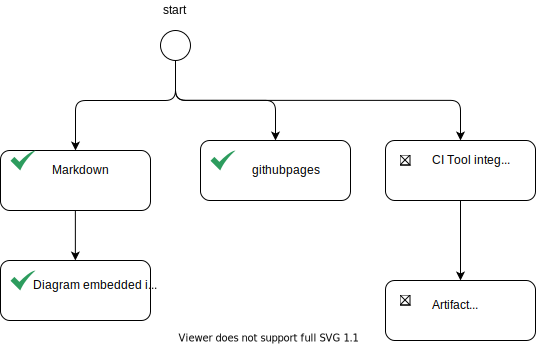
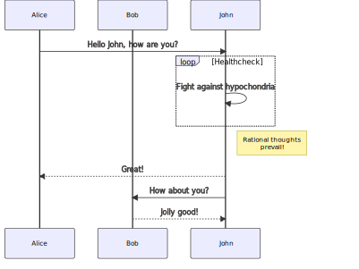

## The beginning
In questi giorni che sto cercando come rimodellare la mia carriera ho dovuto fare in conti con tante cose che dovrebbero essere nelle mie competenze.

Ed è come un percorso da fare a ritroso che ti conduce, di fatto, all'inizio.

E l'inizio, ovvero la prima competenza che devo acquisire, è "come rendere pubblico quello che provo ad imparare" o altrimenti e più semplicemente, come prenderne nota

Poichè vorrei continuare ad occuparmi di software github è il luogo di elezione.

Quindi necessito di tutti gli strumenti per poter pubblicare i miei studi su github nel modo più efficiente possibile, ovvero tutti gli strumenti per diventare un vero e proprio githubber.

Per questo motivo ecco questa roadmap per diventare un favoloso githubber.
## (My) Roadmap 



### Markdown
Obvously to edit something I need to know Markdown. Markdown is pretty simple and all it needed is there [Markdown Cheat sheet](https://www.markdownguide.org/cheat-sheet/).

Using Markdown imply to have a good editor to do that. I choose Visual Studio Code and the list of plugins described [here](https://betterprogramming.pub/top-5-vscode-extensions-to-boost-productivity-when-using-markdown-b4d1bbeb7175).

In case editing of Markdown files is needed via github editor, the chrome plugin [Monaco Markdown Editor](https://chrome.google.com/webstore/detail/monaco-markdown-editor-fo/mmpbdjdnmhgkpligeniippcgfmkgkpnf/related) can be useful.

### Be able to embed diagrams

Also editing diagram and embedding them directly to markdown it is useful. To do so, I chose drawio plugin for VSCode, editing svg file and embed it directly. Here an example embedding a diagram generade with Marmaid VSCOde Plugin



### CI Tools

### Artifacts repository

Markdown is a lightweight and easy-to-use syntax for styling your writing. It includes conventions for

```markdown
Syntax highlighted code block

# Header 1
## Header 2
### Header 3

- Bulleted
- List

1. Numbered
2. List

**Bold** and _Italic_ and `Code` text

[Link](url) and 
```

For more details see [Basic writing and formatting syntax](https://docs.github.com/en/github/writing-on-github/getting-started-with-writing-and-formatting-on-github/basic-writing-and-formatting-syntax).

### Jekyll Themes

Your Pages site will use the layout and styles from the Jekyll theme you have selected in your [repository settings](https://github.com/albertorugnone/githubber-roadmap/settings/pages). The name of this theme is saved in the Jekyll `_config.yml` configuration file.

### Support or Contact

Having trouble with Pages? Check out our [documentation](https://docs.github.com/categories/github-pages-basics/) or [contact support](https://support.github.com/contact) and we’ll help you sort it out.
