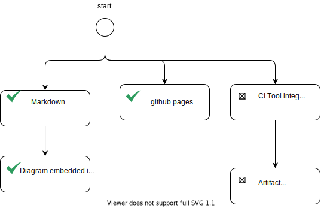

## The beginning
These days that I'm trying to figure out how to reshape my career, I've had to come to terms with so many things that should be in my skill set.

And it's like a path to go backwards that leads you, in fact, to the beginning.

And the beginning, which is the first skill I need to acquire, is "how to make public what I'm trying to learn" or otherwise and more simply, how to take note of it

As I would like to continue to deal with software github is the place of choice.

So I need all the tools to be able to publish my studies on github in the most efficient way possible, that is all the tools to become a real githubber.

So here is this roadmap to becoming a fabulous githubber.
## (My) Roadmap 

### Markdown
Obvously to edit something I need to know Markdown. Markdown is pretty simple and all it needed is there [Markdown Cheat sheet](https://www.markdownguide.org/cheat-sheet/).

Using Markdown imply to have a good editor to do that. I choose Visual Studio Code and the list of plugins described [here](https://betterprogramming.pub/top-5-vscode-extensions-to-boost-productivity-when-using-markdown-b4d1bbeb7175).

In case editing of Markdown files is needed via github editor, the chrome plugin [Monaco Markdown Editor](https://chrome.google.com/webstore/detail/monaco-markdown-editor-fo/mmpbdjdnmhgkpligeniippcgfmkgkpnf/related) can be useful.

### Be able to embed diagrams

Also editing diagram and embedding them directly to markdown it is useful. To do so, I chose drawio plugin for VSCode, editing svg file and embed it directly. Here an example embedding a diagram generade with Marmaid VSCOde Plugin

### CI Tools
TODO
### Artifacts repository
TODO